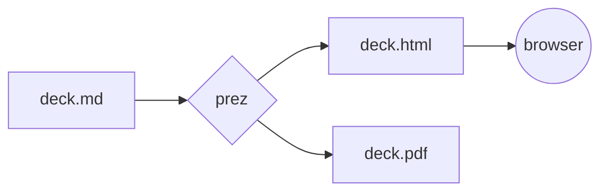

<!-- class: title -->

# prez

Markdown in. One self-contained HTML presentation out.

<!-- notes: This slide uses class: title. Speaker notes are lifted from the whole deck before it is split, so this line reaches no artifact by any route. -->

---

## What it is

- A **pipeline**, not a presentation tool. It writes a file and stops.
- The browser presents. There is no server and no viewer, and there never will be.
- One `.html` with everything inside it — opens offline, from a USB stick, in five years.

```
deck.md  +  theme  ──prez──▶  deck.html   (is the presentation)
                             └▶  deck.pdf    (one slide per page)
```

---

## The surface

| you type        | you get                           |
| --------------- | --------------------------------- |
| `prez build`    | one self-contained `.html`        |
| `prez pdf`      | one slide per 254 × 142.9 mm page |
| `prez present`  | a de-chromed fullscreen deck      |
| `prez build -w` | rebuild on every save             |

Themes are orthogonal to content: `--theme=simple`, or a path, or a name on `PREZ_THEME_PATH`. A name that matches nothing is refused, never quietly swapped for the default.

---

<!-- class: quote -->

> A check must be able to go red, and only a real defect may turn it red.

---

## Front matter is not YAML

Flat `key: value`, and only at the very top of the file:

```yaml
---
title: A Deck
theme: simple
mermaid: true
---
```

Those `---` lines sit inside a fence, so they do not split this slide. A deck that documents its own syntax is the case that breaks a naive splitter, and it is why the fence rule has one home and two readers.

---

## Diagrams, when you ask for them



Opt in with `mermaid: true`. Leave it out and the artifact carries zero mermaid bytes — 9 KB instead of 3.5 MB.

---

<!-- background: #101418 -->
<!-- class: center -->

## The escape hatch

<div style="display:flex;gap:2rem;align-items:center;justify-content:center;font-family:ui-monospace,monospace">
  <span style="font-size:3.5em;line-height:1">&rarr;</span>
  <span style="opacity:.8;text-align:left">raw HTML passes through untouched.<br>a slide can be anything you can write.</span>
</div>

---

<!-- class: small -->

## What holds it up

- **111 unit tests** across nine modules, plus **nine acceptance tests** that drive the built binary.
- Two defects caught in review before they shipped: a speaker note torn in half by a slide break and rendered as body text, and a deck opening with `---` losing its entire first slide. Both fixed at the root.
- ~~One dependency~~ — comrak. Args, front matter, splitting, inlining, base64 and the browser shell-out are all hand-rolled.
- [x] no server
- [x] no viewer
- [x] no network, ever

---

<!-- class: title -->

## Press `f`

`→` `space` next · `←` prev · `Home` `End` · `f` fullscreen · `Esc` overview grid, click to jump

The counter is bottom-right, and `#5` in the URL deep-links to slide five and survives a reload.
